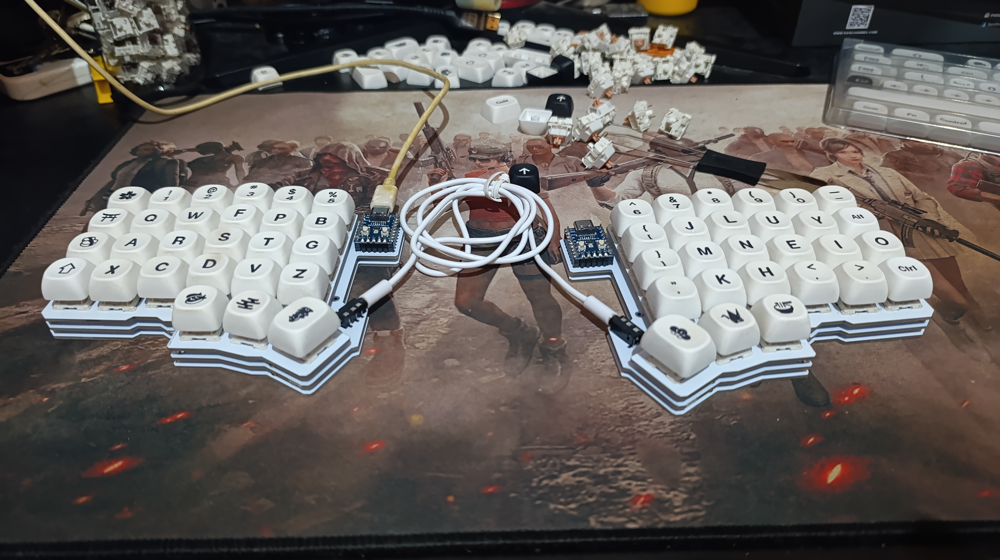
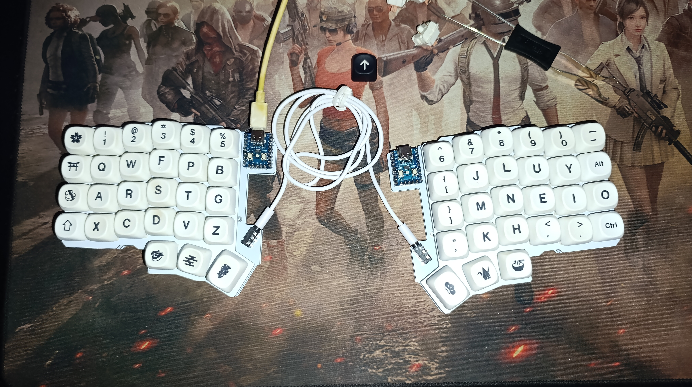

# Silakka54 Keyboard

This repository contains files related to the **Silakka54** custom mechanical keyboard. The primary file is a Vial layout configuration (`Flp.vil`) along with photos of the board and its layer diagrams.

## Vial Layout

The `Silakka54/Flp.vil` file is a Vial configuration. Use it with QMK/Vial to flash or modify the keymap for your Silakka54 keyboard.

## Gallery

Images of the keyboard and each layer are available under `Silakka54/Gallery`.

### Keyboard Photos

### Layer Diagrams

